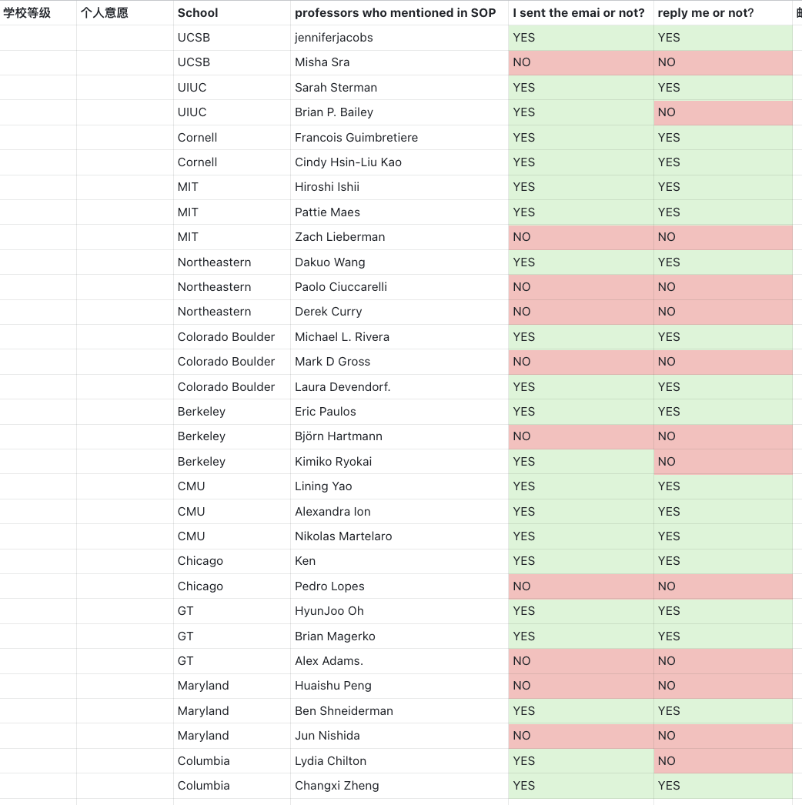
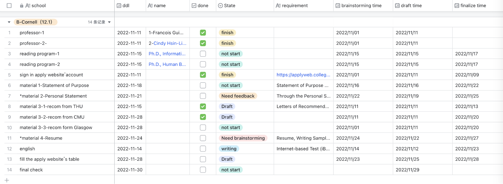

为了让你的申请看起来秩序井然，我们非常建议你自己整理一份申请信息的表格，方便你管理项目 timeline、总结项目信息等。常见的元素包括项目名称、申请系统链接、标化成绩邮寄方式、推荐人分配、特殊的申请材料要求、项目网址、其它你了解到的相关信息链接等。

下面是两个例子：

下面是另外一个实例：

- 第一张表格记录陶瓷情况，从左到右分别是：
    1. 学校等级：学校客观的评价
    2. 个人意愿：个人对学校的求学意愿，想不想去？为什么想去？
    3. 学校名
    4. Professor who mentioned in sop：打算把谁写进材料？
    5. 是否发送套瓷信？
    6. 是否收到回复？
    7. 聊天内容纪要：聊到哪个程度？

- 第二张表格关注的是申请资料管理
    - 从左到右依次是：院校、导师、导师邮箱、完成程度，申请ddl、官网申请要求、lab、研究方向、自己准备材料时间、完稿时间

Thanks to Vincent, David and Dahai.
